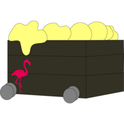

# New web site

Congrats! You have a web site. Now you can start adding content to it!

You can [link to other pages](pagename) on your site, [link to external pages](https://example.com/),
and make *simple style* and **emphasis** changes using Markdown syntax.

* Lists look like this
* And can be nested
  1. With numbered or bulleted lists
  2. as deeply as you wish

Inline HTML can be used if needed

